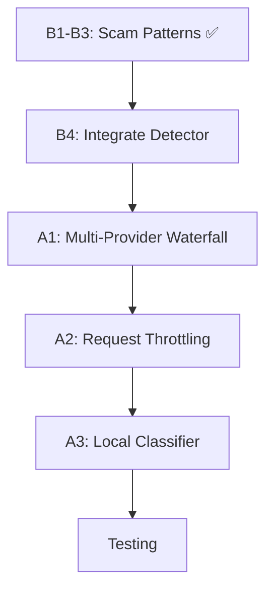

# PLAN: Enhanced Scam Detection & Rate Limiting System

> **Status:** IN PROGRESS  
> **Created:** 2026-01-29  
> **Scope:** Rate Limiting (A+B+C) + Scam Detection (A+B+C)

---

## Phase -1: Context Check ✅

| Item | Status |
|------|--------|
| Project Type | Python FastAPI Honeypot |
| Existing Code | `core/enhanced_detector.py`, `core/multi_llm_detector.py` |
| Tech Stack | FastAPI, Gemini 3, Groq, asyncio |
| User Goal | Avoid rate limiting + detect 2025 Indian scams |

---

## Phase 0: Socratic Gate ✅

**Questions Asked & Answered:**

1. **Build custom LLM?** → NO (not feasible for hackathon timeline)
2. **Which approach?** → User chose A+B+C for BOTH rate limiting and detection
3. **Priority scams?** → Digital arrest, UPI fraud, AI voice clone (from 2025 research)

---

## Phase 1: Task Breakdown

### Part A: Rate Limiting System

| Task | File | Effort | Status |
|------|------|--------|--------|
| A1. Multi-Provider Waterfall | `core/multi_llm_detector.py` | 10 min | ⬜ TODO |
| A2. Request Throttling Queue | `core/request_queue.py` | 10 min | ⬜ TODO |
| A3. Local ML Classifier | `core/local_classifier.py` | 15 min | ⬜ TODO |

**A1: Multi-Provider Waterfall**
```
Gemini 3 → [429] → Groq → [429] → Together AI → [429] → Local
```
- Add Together AI provider
- Implement automatic failover on rate limit
- Exponential backoff with jitter

**A2: Request Throttling Queue**
```python
max_concurrent = 3
queue = asyncio.Queue()
semaphore = asyncio.Semaphore(3)
```
- Limit concurrent LLM calls
- Queue excess requests
- Prevent rate limit errors proactively

**A3: Local ML Classifier**
```
Message → TF-IDF + Rule Score → [>0.7 or <0.3] → Skip LLM
                              → [0.3-0.7] → Call LLM
```
- Fast local classification for obvious cases
- Only use LLM for uncertain messages
- 60-70% of requests skip API entirely

---

### Part B: 2025 Scam Detection

| Task | File | Effort | Status |
|------|------|--------|--------|
| B1. 2025 Keywords | `utils/scam_patterns_2025.py` | 5 min | ✅ DONE |
| B2. Semantic Patterns | `utils/scam_patterns_2025.py` | 5 min | ✅ DONE |
| B3. Template Database | `utils/scam_patterns_2025.py` | 5 min | ✅ DONE |
| B4. Integrate with Detector | `core/enhanced_detector.py` | 10 min | ⬜ TODO |

**Scam Categories (by 2025 losses):**
| Priority | Category | Est. Losses |
|----------|----------|-------------|
| 🔴 P0 | Digital Arrest | ₹2,000 Cr |
| 🔴 P0 | UPI Fraud | ₹1,087 Cr |
| 🔴 P0 | AI Voice Clone | Growing |
| 🟡 P1 | Investment/Crypto | ₹500+ Cr |
| 🟡 P1 | Task/Job Scams | High volume |
| 🟢 P2 | Lottery/Reward | Classic |
| 🟢 P2 | Phishing | Persistent |

---

## Phase 2: Implementation Order



### Step-by-Step Execution:

| Step | Task | Time | Dependencies |
|------|------|------|--------------|
| 1 | ✅ Create `scam_patterns_2025.py` | Done | None |
| 2 | ⬜ Integrate into `enhanced_detector.py` | 10 min | Step 1 |
| 3 | ⬜ Add waterfall failover to `multi_llm_detector.py` | 10 min | None |
| 4 | ⬜ Create `request_queue.py` | 10 min | Step 3 |
| 5 | ⬜ Create `local_classifier.py` | 15 min | None |
| 6 | ⬜ Full integration test | 10 min | All above |

**Total Estimated Time: ~45 minutes**

---

## Phase 3: Files to Create/Modify

### New Files
| File | Purpose |
|------|---------|
| `utils/scam_patterns_2025.py` ✅ | Keywords + Semantic + Templates |
| `core/request_queue.py` | Rate limit aware queue |
| `core/local_classifier.py` | Fast local ML classifier |

### Modified Files
| File | Changes |
|------|---------|
| `core/multi_llm_detector.py` | Add waterfall + throttling |
| `core/enhanced_detector.py` | Integrate 2025 engine |
| `.env` | Add Together AI key (optional) |

---

## Phase 4: Verification Checklist

### Scam Detection Tests
- [ ] Digital arrest scam → Detected with >0.8 confidence
- [ ] UPI fraud scam → Detected with >0.8 confidence
- [ ] AI voice clone → Detected with >0.7 confidence
- [ ] Legitimate message → NOT detected (<0.3 confidence)
- [ ] All 8 test scenarios pass

### Rate Limiting Tests
- [ ] Send 10 rapid requests → No 429 errors returned
- [ ] Rate limit triggered → Automatic failover works
- [ ] Local classifier → Obvious scams skip LLM
- [ ] Queue system → No dropped requests

### Hackathon Requirements
- [ ] `isScam` field present and accurate
- [ ] `confidence` between 0.0-1.0
- [ ] `intelligenceQualityScore` capped at 10.0
- [ ] Response time < 5 seconds
- [ ] No API crashes under load

---

## Phase 5: Agent Assignment

| Task | Agent | Skills |
|------|-------|--------|
| Rate Limiting | backend-specialist | api-patterns, performance |
| Scam Patterns | backend-specialist | python-patterns |
| Local ML | backend-specialist | python-patterns |
| Testing | debugger | testing-patterns |

---

## Next Steps

After plan approval:
1. Run implementation in order (Steps 2-6)
2. Test each component individually
3. Full integration test
4. Update walkthrough with results

---

**Ready to proceed with implementation?**
